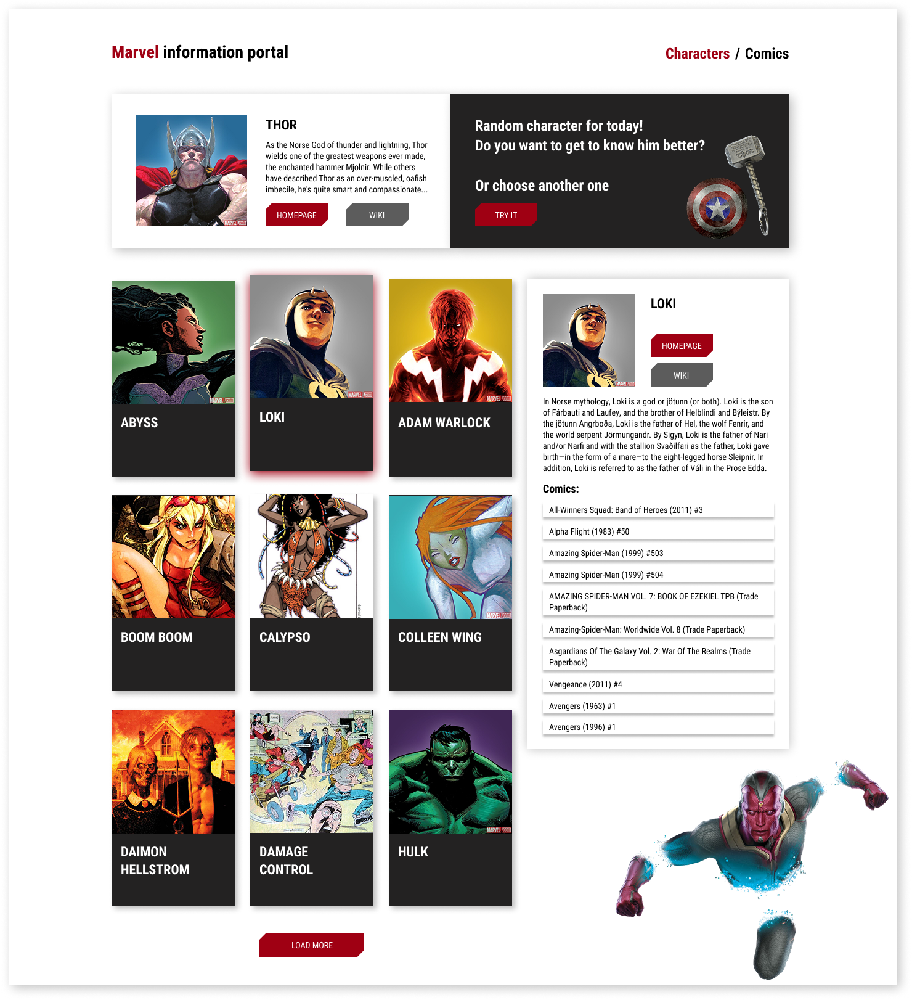
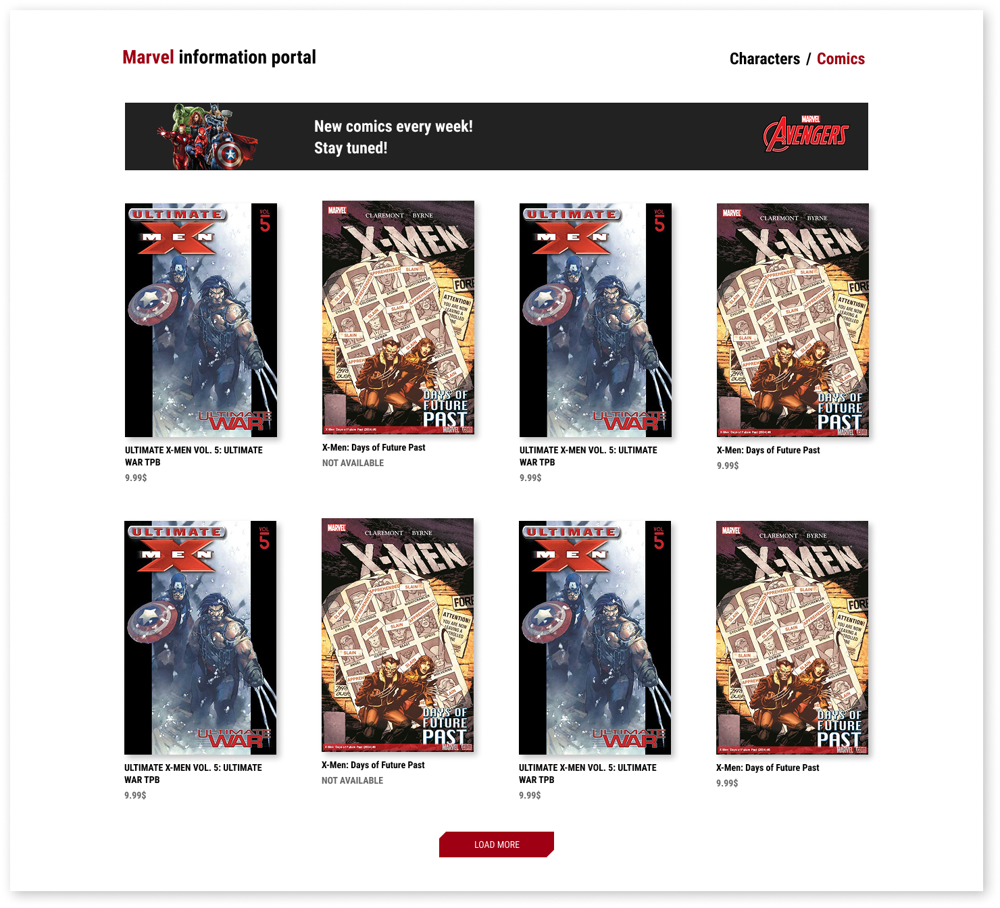
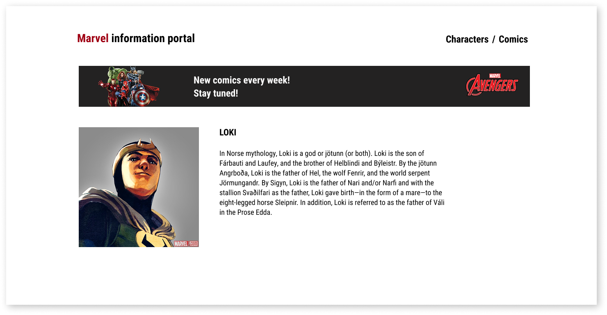
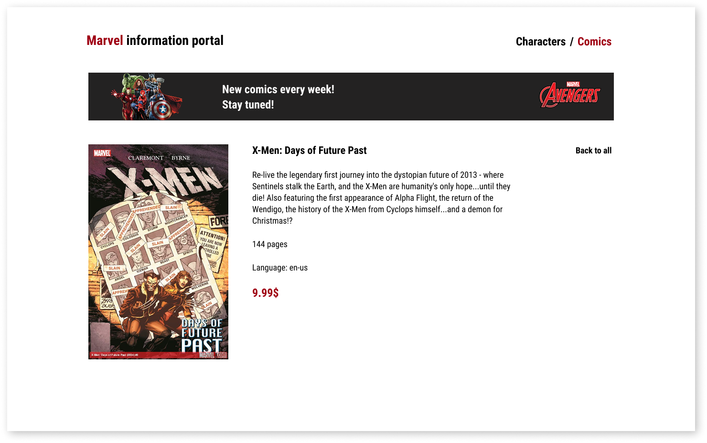
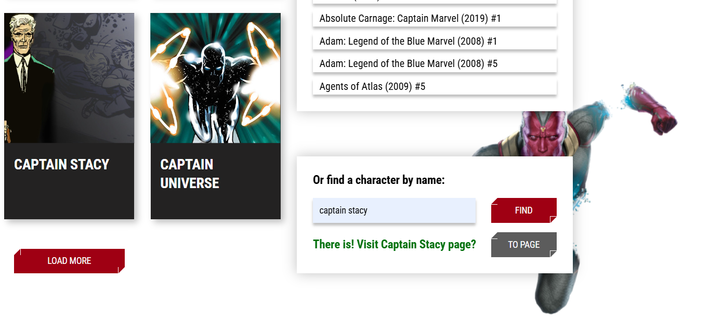

# An application created with the React library, as well as using the Marvel API. 

## Demonstration

🌐 Project deployed on server : http://37.1.215.81:3002 deploy infrastructure:
- VPS (Ubuntu 20.04)
- Nginx
- Docker


<p align="center">
  
  
  
  
  
</p>

## Technologies

-   React 18.3.1 
-   React Router 6.29.0
-   Formik + Yup
-   Framer-motion


## Setup

```bash
$ git clone https://github.com/AnastasiaDubinina022/Marvel-info-portal-onHooks.git
$ cd marvel-information-portal-onHooks
$ npm i
$ npm start
```

## Build

```bash
$ npm build
```